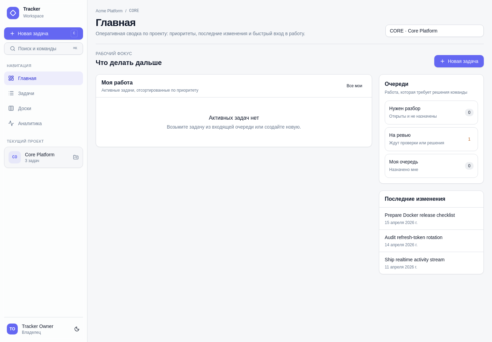
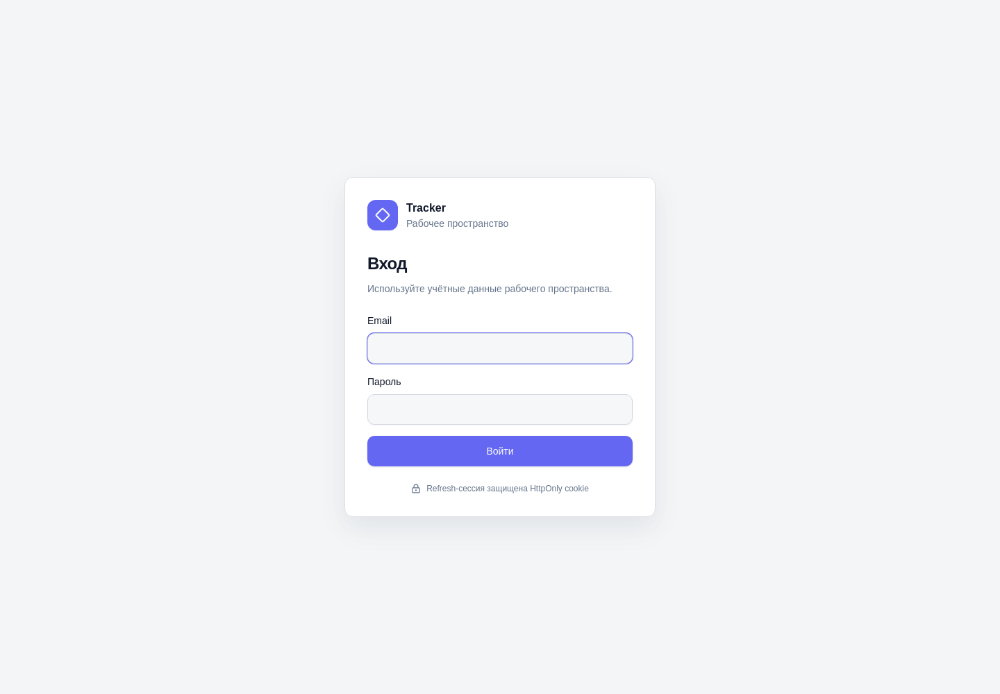
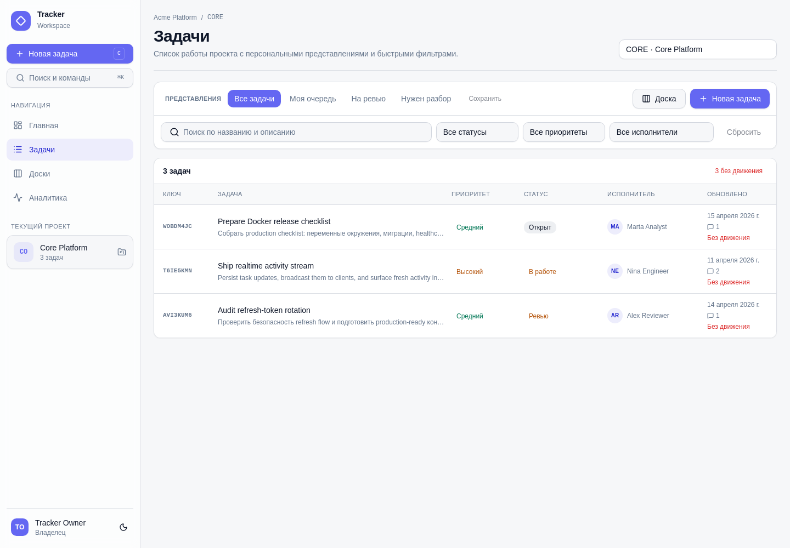
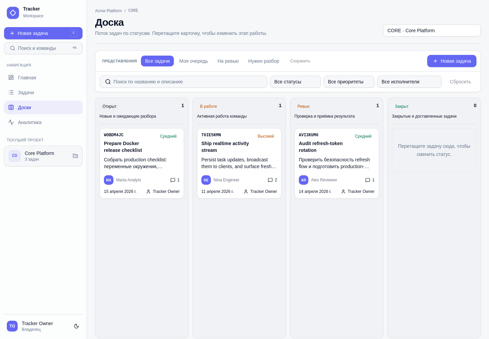
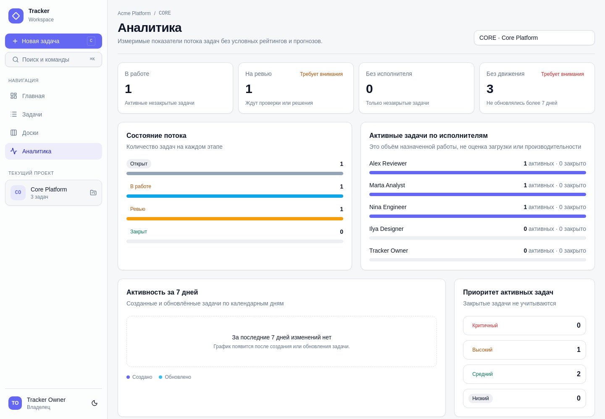
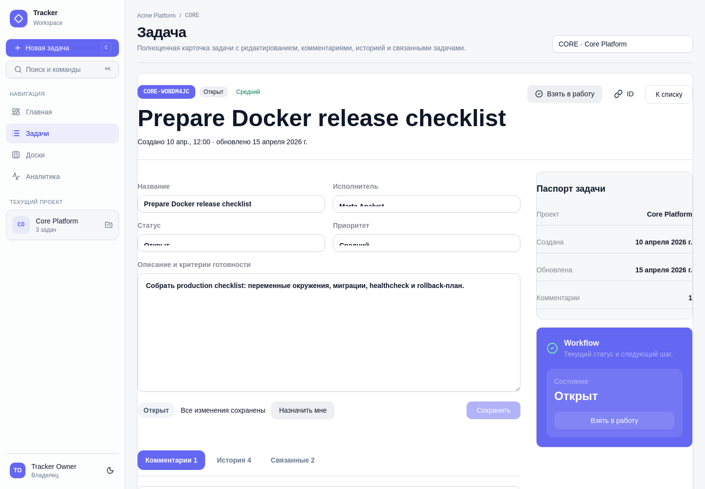
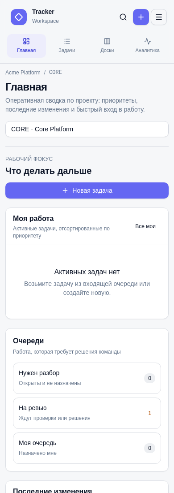
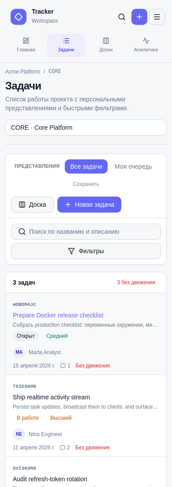
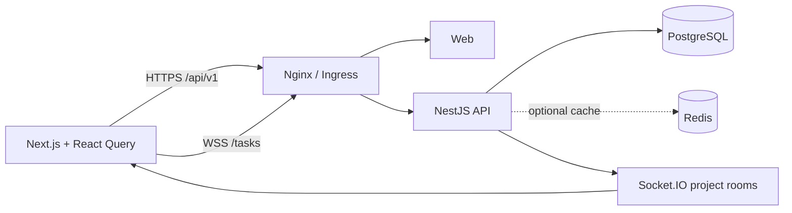

<div align="center">
  
  <h1>Tracker</h1>
  <p><strong>Командный task tracker с организациями, ролями, realtime-доской и безопасной browser session.</strong></p>

  [](https://github.com/minkinad/tracker/actions/workflows/ci.yml)
  [](https://github.com/minkinad/tracker/actions/workflows/codeql.yml)
  [](https://nodejs.org/)
  [](https://pnpm.io/)
  [](./LICENSE)

  [Возможности](#возможности) · [Быстрый старт](#быстрый-старт) · [Архитектура](#архитектура) · [Безопасность](#безопасность) · [FAQ](#faq)
</div>

---

Tracker — full-stack монорепозиторий для управления проектами и задачами. Актуальный интерфейс построен
вокруг личного фокуса, очередей разбора, компактного списка, Kanban и измеримой аналитики потока.
Frontend и API развёртываются независимо, а backend сохраняет границы модульного монолита.

> [!IMPORTANT]
> Репозиторий предоставляет укреплённый baseline, но не заменяет production-платформу. Перед публичным
> запуском нужны TLS, внешний secret manager, managed data services, backup/restore и observability.
> Актуальная готовность описана в [`docs/PROJECT_STATUS.md`](./docs/PROJECT_STATUS.md).

## Возможности

- организации, membership-роли `OWNER` / `ADMIN` / `MEMBER` и проекты;
- задачи с приоритетами, статусами, исполнителями, фильтрами и локально сохранёнными представлениями;
- рабочая главная с личной очередью, разбором, review и последними изменениями;
- компактный list view, Kanban с drag-and-drop и едиными фильтрами;
- измеримая аналитика WIP, review, незакреплённых и давно не обновлённых задач;
- полноценная карточка задачи с редактированием, комментариями, activity и подборкой похожих задач;
- command palette, горячая клавиша создания, светлая/тёмная тема и responsive mobile UI;
- комментарии и история активности;
- realtime-инвалидация данных через защищённые project rooms Socket.IO;
- приглашения с одноразовым токеном и сроком действия;
- versioned HTTP contract `/api/v1` и Swagger;
- liveness/readiness endpoints для контейнерной оркестрации;
- Docker Compose и Kubernetes base с restricted security context;
- CI: lint, typecheck, 17 API tests, build, dependency audit, CodeQL и Dependency Review.

## Интерфейс



| Вход | Список задач |
| --- | --- |
|  |  |

| Kanban | Аналитика потока |
| --- | --- |
|  |  |

<details>
<summary><strong>Карточка задачи и мобильный интерфейс</strong></summary>



| Мобильная главная | Мобильный список |
| --- | --- |
|  |  |

</details>

## Архитектура



```text
apps/
  api/                  NestJS modular monolith
  web/                  Next.js App Router client
packages/
  db/                   Prisma schema, migrations and explicit seed
  types/                shared transport contracts
  ui/                   reusable UI primitives
docs/
  adr/                  accepted architecture decisions
  operations/           deployment and incident runbook
k8s/base/               local/reference Kubernetes manifests
```

PostgreSQL — единственный источник истины. Redis ускоряет списки задач, но не участвует в security
decisions: при его отказе API продолжает работать без кеша. Realtime передаёт только сигнал об изменении,
после которого клиент перечитывает каноническое состояние по HTTP.

Подробности: [`docs/ARCHITECTURE.md`](./docs/ARCHITECTURE.md) и
[`docs/adr`](./docs/adr).

## Безопасность

Ключевые гарантии текущего baseline:

- API закрыт глобальным JWT guard; публичные routes помечаются явно;
- доступ к организации/проекту выводится из authenticated user и membership в базе;
- access token хранится только в памяти browser tab;
- refresh token находится в scoped `HttpOnly`, `SameSite=Strict` cookie, хранится как hash и ротируется;
- reuse отозванного refresh token отзывает всю token family;
- WebSocket проверяет token claims, активность пользователя и project access до room join;
- env validation запрещает короткие, placeholder и одинаковые JWT secrets, wildcard credentialed CORS;
- production runtime выполняет `prisma migrate deploy`, а demo seed выключен по умолчанию;
- сервисы запускаются без root, с read-only filesystem/capability restrictions;
- plaintext Kubernetes Secret не хранится в репозитории;
- high-severity dependency audit на 2026-08-27: 0 известных уязвимостей.

Не публикуйте уязвимости в issues. Используйте процедуру из [`SECURITY.md`](./SECURITY.md). Полная модель
угроз и residual risks: [`docs/THREAT_MODEL.md`](./docs/THREAT_MODEL.md).

## Технологии

| Область | Стек |
| --- | --- |
| Web | Next.js 15, React 19, shadcn/ui, Radix UI, React Query 5, Zustand 5, dnd-kit |
| API | NestJS 11, Passport JWT, Socket.IO 4, class-validator |
| Data | PostgreSQL 16, Prisma 6, Redis 7 |
| Tooling | TypeScript 5.9, ESLint 8, Node test runner, pnpm 9 |
| Delivery | Docker Compose, unprivileged Nginx, Kustomize, GitHub Actions |

## Быстрый старт

### Требования

- Node.js `>=22.13.1`;
- Corepack и pnpm `9.15.4`;
- Docker + Compose для рекомендуемого локального контура.

### Docker Compose

```bash
git clone https://github.com/minkinad/tracker.git
cd tracker
cp .env.example .env
```

Сгенерируйте четыре независимых значения (`openssl rand -base64 48`) и заполните в `.env`:

- `POSTGRES_PASSWORD`;
- `REDIS_PASSWORD`;
- `JWT_ACCESS_SECRET`;
- `JWT_REFRESH_SECRET`.

Для демонстрационных данных дополнительно задайте сильный `DEMO_USER_PASSWORD` и только локально
переключите `SEED_DEMO_DATA=true`. Затем:

```bash
docker compose up --build -d
docker compose ps
```

| Сервис | Адрес |
| --- | --- |
| Web через Nginx | `http://localhost:8080` |
| API v1 | `http://localhost:8080/api/v1` |
| Swagger (если включён) | `http://localhost:8080/api/docs` |
| API readiness | `http://localhost:8080/api/health/ready` |

Прямые порты PostgreSQL, Redis и API привязаны к loopback для локальной диагностики. Web-контейнер
доступен только внутри Compose-сети: единственной браузерной точкой входа является Nginx на `8080`.

Остановить окружение:

```bash
docker compose down
```

Команда `pnpm docker:down` удаляет volumes (`down -v`) и предназначена только для осознанного сброса
локальных данных.

### Запуск приложений без Docker

Поднимите PostgreSQL и Redis, затем:

```bash
npm install --global pnpm@9.15.4
pnpm install --frozen-lockfile
cp apps/api/.env.example apps/api/.env
cp apps/web/.env.example apps/web/.env.local
pnpm db:generate
pnpm db:migrate
pnpm dev
```

Перед стартом заполните сильные и разные JWT secrets, корректные `DATABASE_URL`/`REDIS_URL`. Seed
выполняется отдельно и только с заданным `DEMO_USER_PASSWORD`:

```bash
pnpm db:seed
```

Локально Web доступен на `http://localhost:3000`, API — на `http://localhost:3001/api/v1`, Swagger —
на `http://localhost:3001/api/docs`.

## Конфигурация

| Переменная | Назначение | Production |
| --- | --- | --- |
| `DATABASE_URL` | PostgreSQL connection string | secret manager |
| `REDIS_URL` | Redis connection string | private network + auth |
| `JWT_ACCESS_SECRET` | Подпись короткого access JWT | уникальный secret, 32+ chars |
| `JWT_REFRESH_SECRET` | Подпись refresh JWT | другой уникальный secret |
| `JWT_ISSUER`, `JWT_AUDIENCE` | Ограничение token context | явные значения |
| `CORS_ORIGIN` | allowlist browser origins | только HTTPS origins |
| `COOKIE_SECURE` | Secure refresh cookie | `true` |
| `SWAGGER_ENABLED` | Swagger UI | обычно `false` |
| `TRUST_PROXY_HOPS` | Число доверенных proxy hops | по topology |
| `SEED_DEMO_DATA` | Автоматический demo seed | `false` |
| `NEXT_PUBLIC_API_URL` | Browser-visible API base | `/api/v1` |
| `NEXT_PUBLIC_SOCKET_URL` | Browser-visible Socket.IO base | публичный HTTPS origin |

Шаблоны: [Compose env](./.env.example), [API env](./apps/api/.env.example),
[Web env](./apps/web/.env.example), [Kubernetes secret env](./k8s/secret.env.example).

## API и realtime

- Прикладной HTTP contract: `/api/v1`.
- Служебные endpoints: `/api/health/live`, `/api/health/ready`.
- Swagger: `/api/docs`, только при `SWAGGER_ENABLED=true`.
- Socket.IO namespace: `/tasks`.
- Subscription event: `project:subscribe`; server event: `task:changed`.

Основные ресурсы: auth, organizations, invitations, projects, users и tasks. Полное описание модулей —
в [`apps/api/README.md`](./apps/api/README.md).

## Команды

```bash
pnpm dev                       # API + Web в watch mode
pnpm lint                      # API + Web ESLint
pnpm typecheck                 # Prisma generate + workspace typecheck
pnpm test                      # 17 API tests
pnpm build                     # production builds
pnpm audit --audit-level high  # dependency vulnerabilities
pnpm db:generate               # Prisma client
pnpm db:migrate                # development migration flow
pnpm db:seed                   # explicit demo seed
```

Документационные скриншоты снимаются с production-сборки через Nginx на `8080`; SVG/PNG логотип и
product preview находятся в [`apps/web/public`](./apps/web/public).

Полная проверка deployment manifests:

```bash
docker compose config --quiet
kubectl kustomize k8s/base >/dev/null
```

## Kubernetes и production

[`k8s/base`](./k8s/base) — reference/local baseline, а не готовая production platform. Инструкция:
[`k8s/README.md`](./k8s/README.md).

Перед production deployment необходимы:

1. TLS ingress и закрытые data-plane endpoints.
2. External Secrets/Vault и ротация credentials.
3. Managed PostgreSQL/Redis, encrypted backup и проверенный restore.
4. Single-run migration job, immutable image tags и запрет demo seed.
5. Distributed rate limit, metrics/traces, alerting и SLO.
6. Branch ruleset с required checks и CODEOWNERS review.

Пошаговые действия и инциденты: [`docs/operations/runbook.md`](./docs/operations/runbook.md).

## FAQ

<details>
<summary><strong>Почему не микросервисы?</strong></summary>

Домены тесно связаны общей транзакционной моделью, а независимый scale profile пока не подтверждён.
Модульный монолит даёт явные границы без сетевой и операционной сложности. Решение записано в
[`ADR-0001`](./docs/adr/0001-modular-monolith.md).

</details>

<details>
<summary><strong>Почему после обновления страницы выполняется refresh?</strong></summary>

Access token намеренно не сохраняется в browser storage. Refresh cookie недоступна JavaScript, поэтому
клиент получает новый короткий access token при bootstrap. См. [`ADR-0002`](./docs/adr/0002-browser-session-model.md).

</details>

<details>
<summary><strong>Можно ли работать без Redis?</strong></summary>

Да. Redis кеширует списки задач и ускоряет чтение, но PostgreSQL остаётся источником истины. Readiness
считает Redis частью текущего deployment contract, поэтому degraded production mode нужно оформлять
отдельным архитектурным решением.

</details>

<details>
<summary><strong>Почему seed не запускается автоматически?</strong></summary>

Безусловный seed в runtime создаёт предсказуемые учётные записи и смешивает deployment с тестовыми
данными. Он включается только явно и требует пароль не короче 12 символов.

</details>

<details>
<summary><strong>Можно ли считать Kubernetes base production-ready?</strong></summary>

Нет. Он демонстрирует workload hardening и network boundaries, но содержит однорепличные data services
без production backup, autoscaling, external secrets и high availability.

</details>

## Документация

- [Архитектура](./docs/ARCHITECTURE.md)
- [Состояние проекта](./docs/PROJECT_STATUS.md)
- [Threat model](./docs/THREAT_MODEL.md)
- [Operations runbook](./docs/operations/runbook.md)
- [Frontend audit](./docs/frontend-audit.md)
- [Обновление скриншотов](./docs/screenshots/README.md)
- [Security policy](./SECURITY.md)
- [Contributing](./CONTRIBUTING.md)
- [Changelog](./CHANGELOG.md)
- [API guide](./apps/api/README.md)
- [Web guide](./apps/web/README.md)

## Участие и поддержка

Перед pull request прочитайте [`CONTRIBUTING.md`](./CONTRIBUTING.md) и локальные `AGENTS.md`. Вопросы и
каналы поддержки перечислены в [`SUPPORT.md`](./SUPPORT.md). Участие регулируется
[`CODE_OF_CONDUCT.md`](./CODE_OF_CONDUCT.md).

## Лицензия

Проект распространяется по лицензии [MIT](./LICENSE).
