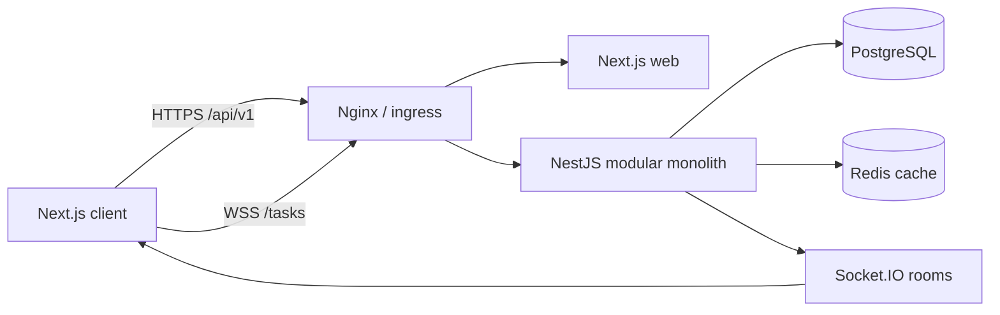
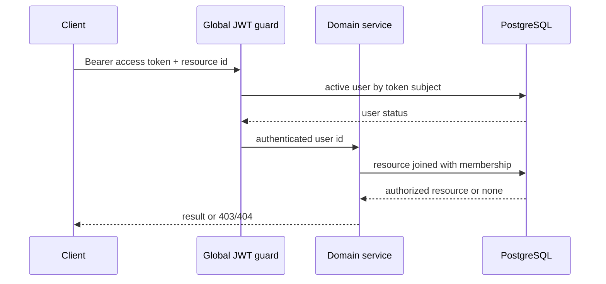
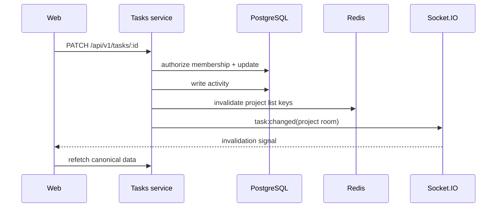

# Архитектура Tracker

## Контекст и цели

Tracker — многопользовательская система управления задачами. Репозиторий построен как pnpm-монорепо:
frontend и API развёртываются независимо, backend остаётся модульным монолитом, а общие контракты и
схема данных вынесены в workspace-пакеты.

Такой дизайн сохраняет транзакционную простоту и быстрые изменения домена без преждевременного
разделения на микросервисы. Границы модулей уже пригодны для последующего извлечения, если появятся
независимые требования к масштабированию или владению.

## Контейнеры

- `apps/web` — App Router UI, React Query, Zustand и Socket.IO client.
- `apps/api` — versioned HTTP API, authorization, domain services и realtime gateway.
- `packages/types` — общие транспортные DTO.
- `packages/ui` — UI-примитивы без бизнес-логики.
- `packages/db` — Prisma schema, migrations и явный seed.
- PostgreSQL — единственный источник истины.
- Redis — необязательный кеш; его отказ ухудшает latency, но не корректность.

## Backend-модули и владение данными

| Модуль | Ответственность | Основные данные |
| --- | --- | --- |
| `auth` | login, refresh rotation, logout, session recovery | `User`, `RefreshToken` |
| `organizations` | доступные организации и membership | `Organization`, `Membership` |
| `invitations` | создание и одноразовое принятие приглашений | `Invitation`, `Membership` |
| `projects` | проекты и проверка project access | `Project`, `Membership` |
| `tasks` | задачи, комментарии, activity, cache events | `Task`, `Comment`, `Activity` |
| `users` | активные пользователи и видимость участников | `User`, `Membership` |
| `realtime` | аутентифицированные project rooms | данных не хранит |
| `health` | liveness/readiness | данных не хранит |

Контроллер вызывает сервис своего модуля. Сервис применяет бизнес-правила и обращается к собственному
repository. Межмодульный вызов идёт через экспортированный service/interface, а не напрямую в repository.

## Граница авторизации

Идентификатор организации или проекта — только selector, но не доказательство доступа. Источник identity —
subject проверенного access JWT; membership перечитывается из базы. Тот же принцип применяется к
Socket.IO rooms и assignee validation.

## Сессия браузера

1. `POST /api/v1/auth/login` проверяет пароль и создаёт refresh family.
2. Короткий access token возвращается клиенту и хранится только в памяти.
3. Refresh token сохраняется как hash и отправляется в scoped `HttpOnly`, `SameSite=Strict` cookie.
4. После перезагрузки frontend вызывает refresh и восстанавливает in-memory access token.
5. Каждый refresh ротирует token. Повторное использование отозванного token отзывает всю family.
6. Logout отзывает family и удаляет cookie.

## Поток изменения задачи

Событие realtime не считается источником состояния: клиент инвалидирует React Query и перечитывает API.
Текущие activity/cache/realtime handlers выполняются после основной mutation и пока не имеют гарантий
transactional outbox; это явно зафиксированный residual risk.

## Deployment topology

- Docker Compose — локальный/односерверный контур. Внутренние порты привязаны к loopback, публичная
  точка — unprivileged Nginx.
- Kubernetes base — демонстрационный self-contained контур с NetworkPolicy и restricted workloads.
- Production — внешний TLS ingress, managed PostgreSQL/Redis, secret manager, backup/restore,
  централизованные метрики/логи и отдельный migration job.

API container выполняет только `prisma migrate deploy`; seed запускается лишь при явном
`SEED_DEMO_DATA=true`. Файлы Secret не хранятся в Git.

## Эволюция

Приоритетные следующие шаги:

1. Transactional outbox для activity/realtime delivery.
2. Распределённый rate limiter для нескольких API replicas.
3. OpenTelemetry traces/metrics и SLO для login/task mutation.
4. E2E browser tests и accessibility regression checks.
5. Production overlay: external secrets, autoscaling, PDB и managed data services.

Решения: [`docs/adr`](./adr), риски: [`THREAT_MODEL.md`](./THREAT_MODEL.md), состояние:
[`PROJECT_STATUS.md`](./PROJECT_STATUS.md).
